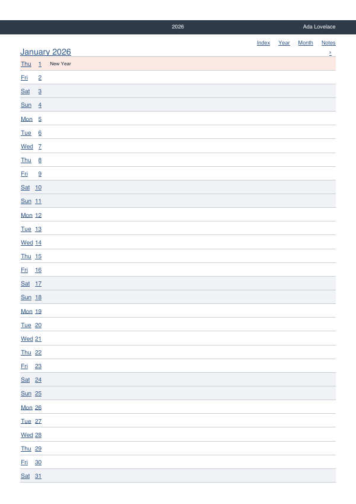
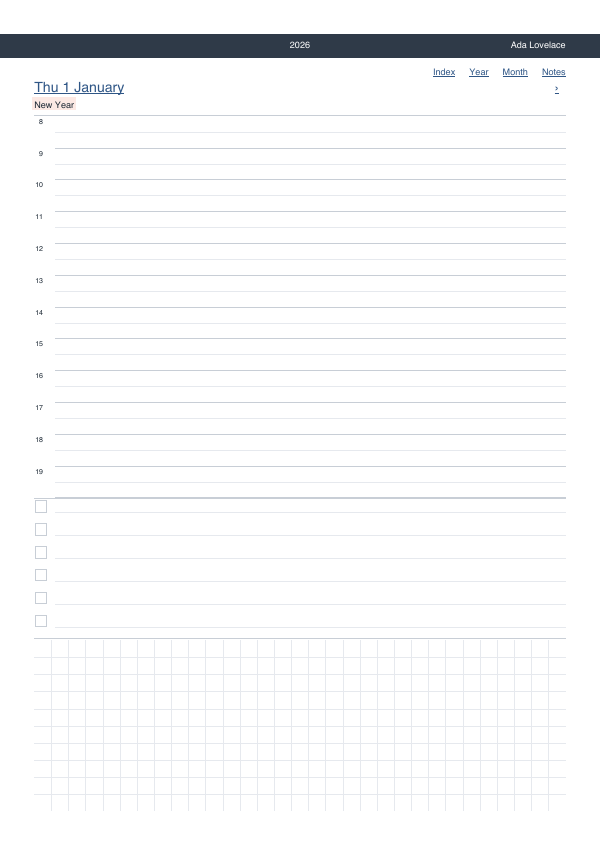

# Ctrl+Grid

[](https://github.com/DocAtPrompt/ctrlgrid/actions/workflows/ci.yml)

**Repository:** <https://github.com/DocAtPrompt/ctrlgrid>

Generate **dimensionally accurate** PDF templates from a small definition file:
grid paper, ruled paper, dot grids, staff paper, mazes, polar targets, tilings,
fillable forms, perspective grids and mandalas — plus a **linked, write-on
calendar** and a **notebook** that binds any of them into one document — for
paper formats **and** for e-ink tablets.

> **Status: 0.10.0 — everything the specification describes is built, and
> audited against a first-time user.** The
> eleven generators of the table below work, and so do the two *document*
> generators (`calendar`, `notebook`); the dimensional test described below
> measures `lines` out of a finished PDF on every commit, and `net` puts the
> same promise in your hands — print a box net, cut it, fold it. The handle around them is finished — multi-page output, headers
> and footers, name lists, snapping, remainder handling, double-sided margins,
> border, background, hole marks, stamp, an edge ruler, the calibration cover sheet, embedded
> font files, dashed and dotted styles, free page sizes, logos in bands, and
> relative measures (`%w`/`%h`/`%s`) so one definition fills paper and a 3:4
> e-ink slate alike.
>
> Nothing in the specification is left unbuilt, so nothing refuses with "a
> later milestone" any more. What is left is not code: a device to verify two
> profile figures on, and a pair of scissors for the box nets.
>
> Working today:
>
> ```bash
> ctrlgrid millimeter-a4 --pages 30 -o grid.pdf
> ctrlgrid calendar-a4 -o 2026.pdf            # a whole linked year planner
> ctrlgrid millimeter-a4 --names class3b.txt      # a sheet per name
> ctrlgrid -d my-def.yaml --stamp DRAFT
> ctrlgrid millimeter-a4 --cover              # + a calibration first sheet
> ctrlgrid check my-def.yaml
> ctrlgrid dots-5mm --device remarkable-paper-pro   # an e-ink profile
> ctrlgrid millimeter-a4 --format a6 --pages 4 --nup 2x2   # four-up on A4
> ctrlgrid presets | show <name> | devices
> ```
>
> Flags: `--pages`, `--names`, `--format`, `--device`, `--orientation`,
> `--stamp`, `--cover`, `--embed-def`, `--seed`, `--strict`,
> `--skip-unsupported`, `--nup`, `--nup-sheet`, `--crop-marks`, `-o`,
> `--force`, `--quiet`.
>
> **Not on PyPI yet** — install straight from this repository (see below).

## Examples

A gallery of A4 examples — one per generator, plus a multi-page maze booklet and
a whole linked calendar — is in [`examples/`](https://github.com/DocAtPrompt/ctrlgrid/blob/main/examples/README.md), each an
ordinary definition file you can copy and bend.

## The one promise

**What says 5 mm measures 5 mm on the printout.** No scaling, no "fit to page",
no stretching a grid so it comes out even. If a grid does not fit the page, you
are told — it is never quietly adjusted.

That promise is enforced by a test that generates a PDF, reads it back and
measures it, on every commit.

## Why another one

Of roughly 60 comparable tools surveyed ([`docs/research.md`](https://github.com/DocAtPrompt/ctrlgrid/blob/main/docs/research.md)),
three can emit more than one page and **none** can drive page content from a
list. Ctrl+Grid is built around exactly that: one command, one finished
multi-page PDF.

```bash
# 30 sheets of millimetre paper
ctrlgrid millimeter-a4 --pages 30 -o grid.pdf

# one sheet per name, each with the name in the header
ctrlgrid millimeter-a4 --names class3b.txt

# a different maze on every page, reproducibly
ctrlgrid maze-medium --pages 20 --seed 4711

# your own definition, on Letter, with a calibration cover sheet
ctrlgrid -d my-def.yaml --format letter --pages 5 --cover

# no arguments: browse the presets interactively
ctrlgrid
```

## Installation

Not on PyPI yet, so install straight from this repository. With
[uv](https://docs.astral.sh/uv/):

```bash
# run it once, without installing anything
uvx --from git+https://github.com/DocAtPrompt/ctrlgrid.git ctrlgrid --help

# or install it as a tool on your PATH
uv tool install git+https://github.com/DocAtPrompt/ctrlgrid.git
ctrlgrid --help
```

Or with pip, into an environment of your choosing:

```bash
pip install git+https://github.com/DocAtPrompt/ctrlgrid.git
```

To work on it, clone and let uv build the environment:

```bash
git clone https://github.com/DocAtPrompt/ctrlgrid.git
cd ctrlgrid
uv sync --extra dev
uv run ctrlgrid --help
```

Python 3.11 or newer. There are no double-clickable installers, and none are
planned.

## What it generates

| Generator | Produces |
|---|---|
| `lines` | squared, ruled, isometric, calligraphy (slanted families), Cornell, log/semi-log |
| `dots` | dot grids with emphasised rows and columns |
| `staves` | music staves and guitar tab, with treble/bass/alto/tenor clefs |
| `grid` | labelled cell blocks — battleship, score sheets |
| `maze` | rectangular mazes, optionally with solutions |
| `polar` | targets, score discs, polar paper |
| `tiling` | hexagons, triangles, rhombi — including colouring patterns |
| `form` | fillable forms: phone logs, checklists, handover sheets |
| `perspective` | one-, two- and three-point vanishing-point grids |
| `mandala` | rotationally symmetric templates: rings, rosettes, star polygons |
| `net` | box nets: a tray or a tuck-top carton from its inner dimensions |

Each of those fills **one page**, as many times as you ask for — `net` fills it
with one figure you cut out and fold, and refuses rather than scale it. Two *document*
generators are the exception, producing whole linked documents instead:
`calendar`, which has its own section below, and `notebook` — sections of pages,
each filled by one of the ten above, with a contents page that links to them:

```yaml
generator: notebook
sections:
  - { label: "Bullet journal", pages: 40, divider: true, generator: dots,
      grid: { x: { base_spacing: 5mm }, y: { base_spacing: 5mm } } }
  - { label: "Music", pages: 10, generator: staves, count: 10,
      stave_space: 1.8mm, clef: treble }
```

One PDF on an e-ink device instead of twelve — `ctrlgrid notebook-a4 -o
notebook.pdf`, or see [`examples/15-notebook.yaml`](https://github.com/DocAtPrompt/ctrlgrid/blob/main/examples/15-notebook.yaml).

The interesting part is the **cycle model**: spacing, stroke weight, size, dash
pattern and colour each follow their own repeating list, and the lists may have
different lengths. "Every fifth line heavier and blue, every third dashed" is one
definition, not a special case.

## A linked, write-on calendar

```bash
ctrlgrid calendar-a4 -o 2026.pdf
```

`calendar` is the one generator that is not a sheet: it owns a whole **document**
— a cover, a contents page, the year on one sheet as twelve mini-months, two
half-year tables, twelve months, one page per day, opt-in week pages and as many
note pads as you like. Every date is an internal PDF link, so on a pen tablet you
tap a date and land on that day, tap a note number and land on that note. About
400 pages from one definition, in a second, and the same definition always gives
the same PDF.

```yaml
generator: calendar
year: 2026
week_start: monday
months: [Januar, Februar, …]        # your language; English if omitted
holidays: [{ date: 2026-12-25, label: Weihnachten }]
holidays_file: feiertage.ics        # or a YAML list — merged with the above
day:
  blocks:                           # an ordered list: reorder, resize, repeat
    - { type: schedule, from: 8, to: 20, height: 55%, half_hours: true }
    - { type: todo,     rows: 6,         height: 20% }
    - { type: notes,    height: rest,    surface: grid }
notes:
  - { count: 20, surface: lines, label: "Journal" }
  - { count: 10, surface: dots,  label: "Sketches" }
```

<p align="center">
  
  
</p>

Marked days carry their own colour — a birthday is not a public holiday — and a
`legend` on the contents page says what each colour means, because the calendar
knows the colours and never their meanings. Names come from your definition, so
the calendar adds no language of its own. It is **PDF only**: links and text
cannot live in a PNG, and the run is refused rather than quietly stripped of its
links.

The whole example is [`examples/12-calendar-year.yaml`](https://github.com/DocAtPrompt/ctrlgrid/blob/main/examples/12-calendar-year.yaml);
the preset is `ctrlgrid show calendar-a4`, and [`HANDBOOK.md`](https://github.com/DocAtPrompt/ctrlgrid/blob/main/HANDBOOK.md)
documents every option.

## Definition files

A definition is YAML with a version line. Start from a preset and change it:

```bash
ctrlgrid presets              # list them
ctrlgrid show millimeter-a4   # print one, ready to copy
ctrlgrid check my-def.yaml    # validate without generating
```

A header or footer field holds free text or a picture —
`left: { image: "logo.png", height: 8mm }`, PNG, with the path relative to the
definition file. Only the height is given; the width follows from the file, so
a logo is never squeezed, and never cropped: it fits or you are told.

Paper size is either a name from the built-in table or two measures of your
own, width first — `format: 210x99mm`, `format: 8.5x11in`. A free size is used
exactly as written; `orientation: landscape` swaps the two.

**The presets are the documentation.** They are ordinary definition files, not a
separate mechanism, so anything a preset does you can do too — and there is no
second syntax reference here to drift out of date.

## E-ink devices

```bash
ctrlgrid devices                              # list known profiles
ctrlgrid dots-5mm --device remarkable-paper-pro
```

Device profiles carry pixels **and** physical size, so millimetres stay
millimetres, and a profile makes the PDF page match the screen exactly — which
is what makes the usual "fit page" view show it at true size. On a device you
can also write lengths in `px`, and `snap: pixel` rounds every step to whole
device pixels so the grid looks even (§ 8.3.1) — it reports the size it settled
on, e.g. `5mm → 4.991mm (45px at 229dpi)`, because a silent change of size is
the one thing this tool will not do.

As soon as the medium is fixed the tool checks the definition against it and
warns about what will not work there — a line too thin to render, a spacing
that merges, two colours that become the same grey (§ 12.1). `--strict` turns
those warnings into errors, which is what a CI run needs to guard a preset set.

Output a **PNG** by giving `-o name.png`: it rasters at the medium's exact
resolution — the Paper Pro's 1620 × 2160 px — one file per page, which is what a
real pad template needs. The PNG writer cannot draw text (the standard fonts
have metrics but no file), so a definition with a header, footer or labels on
PNG is refused up front, naming the way out: a font file, or PDF.

Adding a profile for your device is the easiest useful contribution — see
[`CONTRIBUTING.md`](https://github.com/DocAtPrompt/ctrlgrid/blob/main/CONTRIBUTING.md).

## Known limitations

Please read these. Each one is a real constraint, and each looks like a bug if
you meet it without warning.

**1. Print at 100 %, not "fit to page".** Most PDF viewers default to fitting the
page and silently scale to about 96 %. Choose "Actual size" / "100 %". Run with
`--cover` to get a first sheet with a 50 mm calibration square and a 100 mm rule:
measure them with a ruler and you will know immediately whether your printer
scaled. For the check on *every* sheet rather than the first one, add a
`ruler:` — a printed scale along the edges of the page, zeroed on the pattern
area, so a real ruler laid against it settles the question at a glance
(`examples/13-ruler-edge.yaml`). That sheet also records the settings that produced the document — format,
margins, base values, cycles, effective period, tool version and a checksum of
the definition — so a print that came out right stays reproducible. It is not
counted in the page numbering, and it is never scaled to fit: on a format too
narrow for the 100 mm rule the run is refused rather than shrunk.

For the fullest record, add `--embed-def`: the PDF then carries its own source
as a file attachment — the exact definition it was built from — so the document
can be regenerated years later without hunting for the file. PDF only; on PNG
output the run is refused with the reason rather than dropping the attachment.

**2. Character coverage is Latin-1 by default.** Without a font file of your own,
`ä ö ü ß é à ñ ç` work but `ł ğ ő` do not — you will hit this on the first Polish
or Turkish name in a list. The fix is to point at a font *file* — a path, never
a font name, because name lookup finds different fonts on different machines:

```yaml
header:
  height: 12mm
  left: "{name}"
  font: { file: "~/Library/Fonts/EBGaramond-Regular.ttf", size: 11pt }
```

The font is embedded and subset, so the PDF is the same everywhere. Its
embedding licence is **checked, not assumed**: a font whose `fsType` forbids
embedding aborts the run and is named — never quietly swapped for another one,
which would change every measurement on the sheet. A character the file itself
lacks is still an error, now naming the file.

**3. Margins below about 5 mm get clipped** by most printers. The default comes
from the paper format and reflects the typical non-printable border; e-ink
profiles use 0.

**4. N-up does not scale.** `--nup 2x2` places pages at 100 % and fails with the
arithmetic if they do not fit, unlike `pdfjam` and `pdfcpu`. The intended use is
the reverse of the usual one: define a small format, impose it onto a large
sheet, cut it up — `--format a6 --nup 2x2` puts four A6 pages on A4.
`--crop-marks` adds cut guides in the margin; `--nup-sheet` picks the sheet.
Imposition drops PDF bookmarks, and the calibration cover sheet is left out of
it.

**5. `{date}` makes output date-dependent.** Two runs on different days produce
different files. If you want a reproducible sheet, write the date as text.

**6. Solutions printed on the back need long-edge duplex.** `solution:
back_mirrored` prints the maze solution mirrored on the reverse so it lines up
when held to the light. Short-edge flipping puts it upside down, and whether it
shows through at all depends on your paper.

**7. There is no GUI**, and none is planned. `ctrlgrid` with no arguments opens
an interactive preset browser — pick a preset, a page count and an output path
(§ 11.2) — and that is as far as it goes. Piped or in CI, where there is no one
to answer, it prints its help instead.

## Documentation

- [`HANDBOOK.md`](https://github.com/DocAtPrompt/ctrlgrid/blob/main/HANDBOOK.md) — the user handbook: install, the page model,
  every generator and option, with worked examples. **Start here.**
- [`docs/pflichtenheft-vorlagengenerator.md`](https://github.com/DocAtPrompt/ctrlgrid/blob/main/docs/pflichtenheft-vorlagengenerator.md) —
  the full specification, in German. Records not just what the tool does but why.
- [`docs/implementation-decisions.md`](https://github.com/DocAtPrompt/ctrlgrid/blob/main/docs/implementation-decisions.md) — the
  points where the specification was silent, and what was decided instead.
- [`docs/research.md`](https://github.com/DocAtPrompt/ctrlgrid/blob/main/docs/research.md) — survey of comparable tools, July 2026.
- [`CONTRIBUTING.md`](https://github.com/DocAtPrompt/ctrlgrid/blob/main/CONTRIBUTING.md) — how to add device profiles, presets and
  code.

## Licence

MIT — see [`LICENSE`](https://github.com/DocAtPrompt/ctrlgrid/blob/main/LICENSE).

The bundled clef font in [`ctrlgrid/data/fonts/`](https://github.com/DocAtPrompt/ctrlgrid/tree/main/ctrlgrid/data/fonts/) is
derived from **Bravura** © Steinberg Media Technologies GmbH, under the
[SIL Open Font License 1.1](https://github.com/DocAtPrompt/ctrlgrid/blob/main/ctrlgrid/data/fonts/OFL.txt) — subset to the four
clef glyphs, converted to TrueType, and renamed as the OFL requires for a
modified version.
