# Examples

A taste of what Ctrl+Grid makes — one A4 example per generator, plus a
multi-page document, the calibration cover sheet, a whole linked calendar, a
notebook of sections, a calligraphy guide and a sheet with a printed ruler along
its edges.
Each is an ordinary definition file: open the `.yaml`, change it, regenerate.
The `.pdf` is the real output (measured, to scale); the image is just a preview.
Only the calendar ships without its PDF — 405 pages is too much to carry in a
repository, and the one command below rebuilds it in about a second.

Try one without installing anything:

```bash
uvx --from git+https://github.com/DocAtPrompt/ctrlgrid.git \
  ctrlgrid -d examples/01-lines-squared.yaml -o out.pdf
```

Everything here is A4. Add `--format a5`, `--format letter` or a
`--device remarkable-paper-pro` to the same command and it re-fits the new
medium — the examples using `%w`/`%h`/`%s` (polar, mandala) fill it
proportionally.

| Preview | What it is |
|---|---|
| 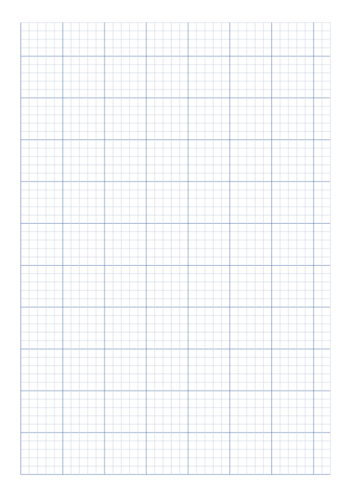 | **`lines`** — 5 mm squared paper filling the whole page from the top-left (`align: top-left`): heavy lines start top-left, cells run to the edges, and the incomplete block falls to the bottom.<br>[`01-lines-squared.yaml`](01-lines-squared.yaml) · [PDF](01-lines-squared.pdf) |
| 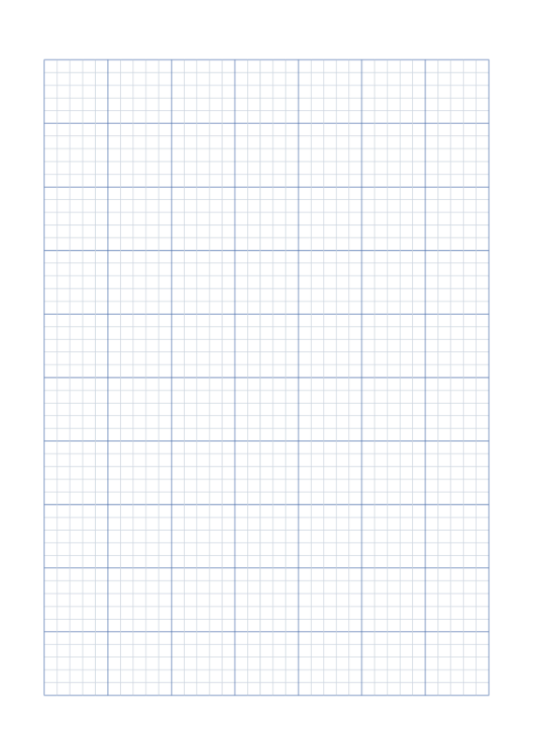 | **`lines`** (complete blocks) — the same, but `snap: cycle` keeps only whole 25 mm blocks, so every edge is a heavy major line and the leftover stays blank margin.<br>[`01b-lines-squared-blocks.yaml`](01b-lines-squared-blocks.yaml) · [PDF](01b-lines-squared-blocks.pdf) |
| 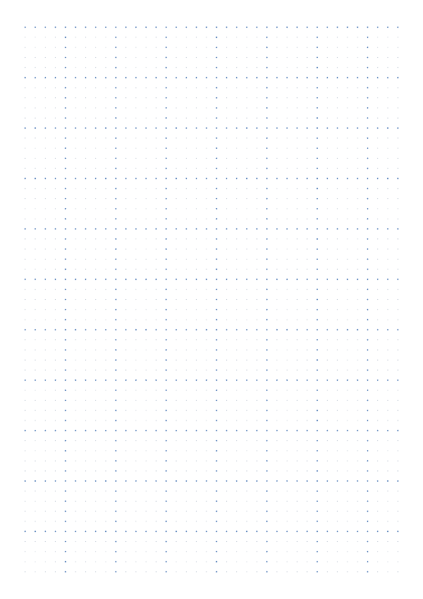 | **`dots`** — a 5 mm dot grid, every fifth dot larger and darker.<br>[`02-dots-grid.yaml`](02-dots-grid.yaml) · [PDF](02-dots-grid.pdf) |
| 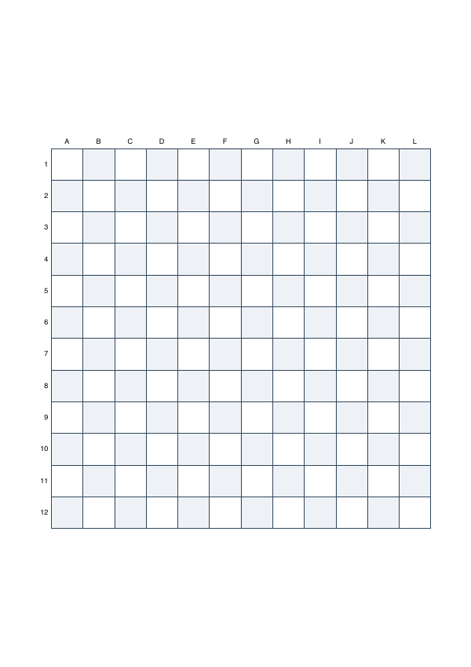 | **`grid`** — a 12 × 12 labelled board (A…, 1…) with a checker fill.<br>[`03-grid-battleship.yaml`](03-grid-battleship.yaml) · [PDF](03-grid-battleship.pdf) |
| 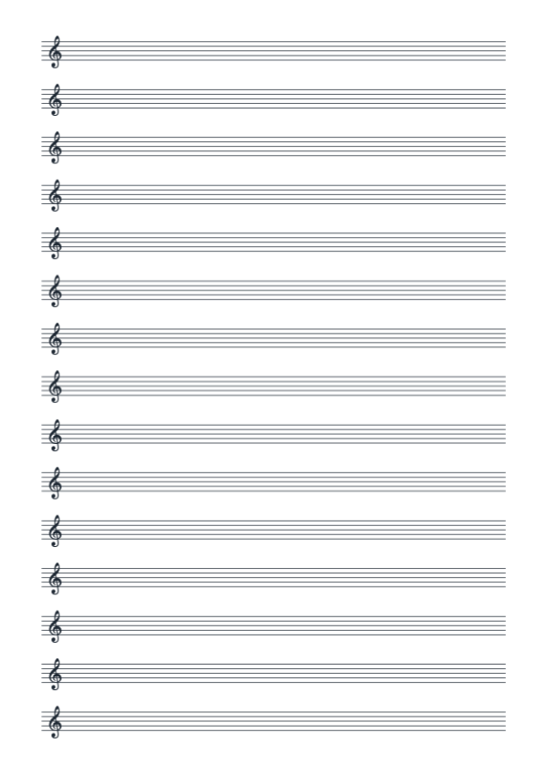 | **`staves`** — treble-clef manuscript paper; the clef is a glyph from the bundled music font.<br>[`04-staves-treble.yaml`](04-staves-treble.yaml) · [PDF](04-staves-treble.pdf) |
| 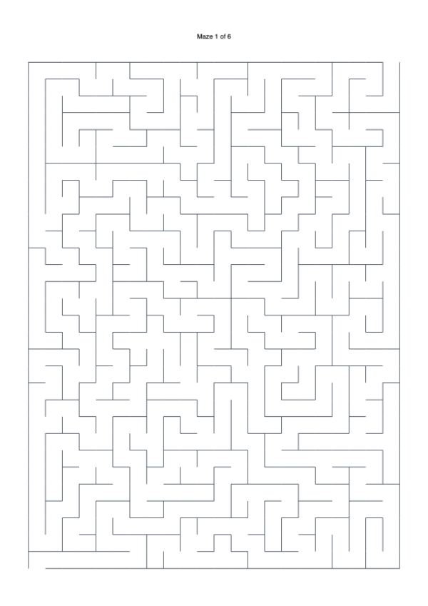 | **`maze` — multi-page** — a booklet of three mazes, each with its solution on the next sheet: six sheets from one command.<br>[`05-maze-booklet.yaml`](05-maze-booklet.yaml) · [PDF](05-maze-booklet.pdf) |
| 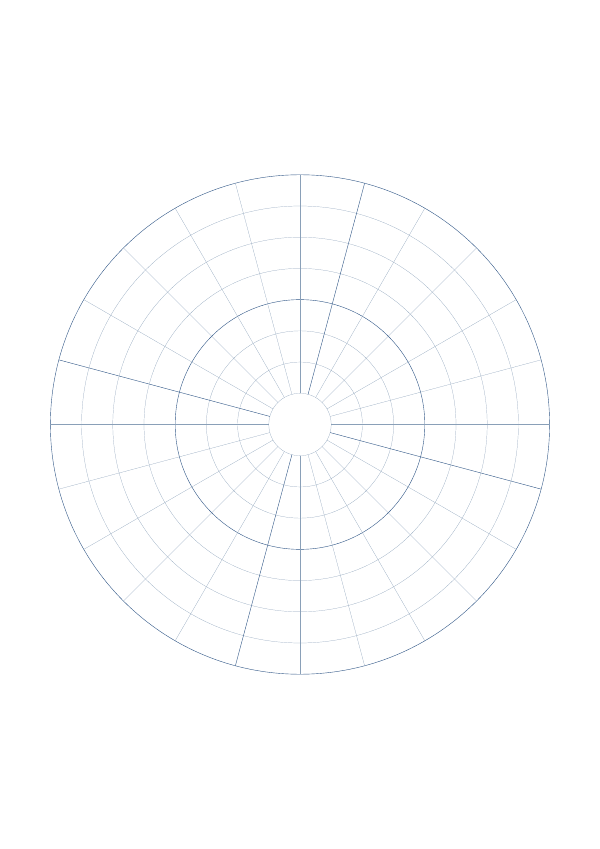 | **`polar`** — a concentric target whose radii are a share of the shorter side (`%s`), so it fills any format.<br>[`06-polar-target.yaml`](06-polar-target.yaml) · [PDF](06-polar-target.pdf) |
| 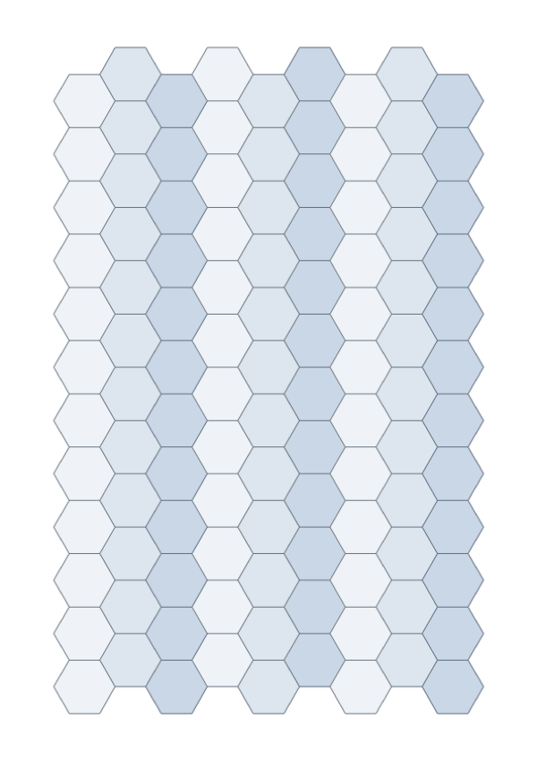 | **`tiling`** — a flat-top hexagon honeycomb with a three-colour fill.<br>[`07-tiling-hex.yaml`](07-tiling-hex.yaml) · [PDF](07-tiling-hex.pdf) |
| 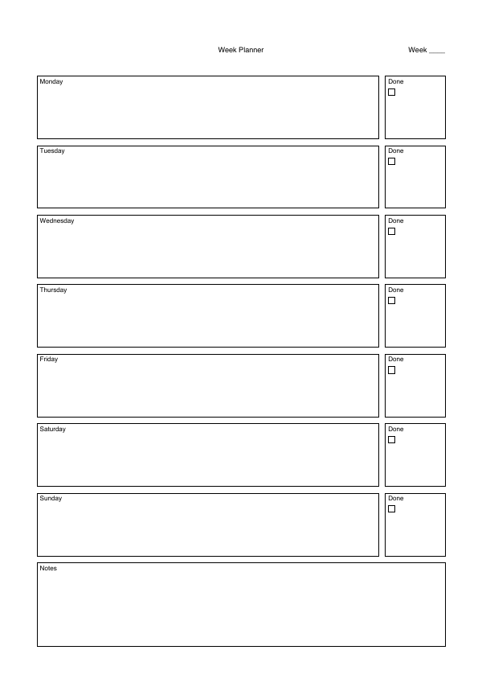 | **`form`** — a weekly planner: seven day rows with a done-box, then a notes block.<br>[`08-form-weekly.yaml`](08-form-weekly.yaml) · [PDF](08-form-weekly.pdf) |
| 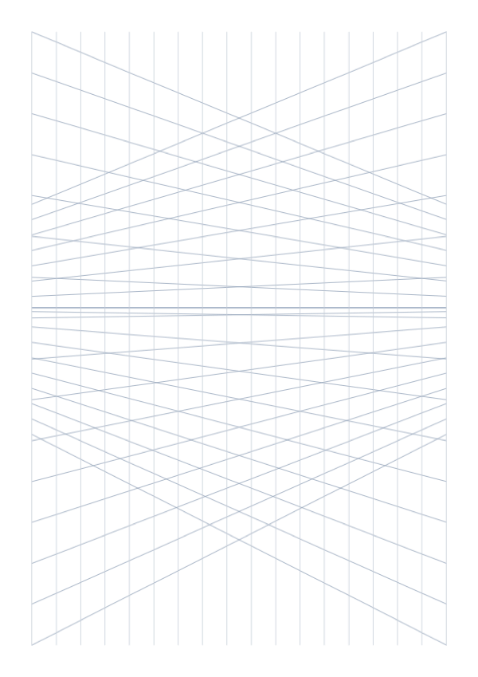 | **`perspective`** — a two-point drawing grid: a horizon, two vanishing points off the sheet, and true verticals.<br>[`09-perspective-2pt.yaml`](09-perspective-2pt.yaml) · [PDF](09-perspective-2pt.pdf) |
| 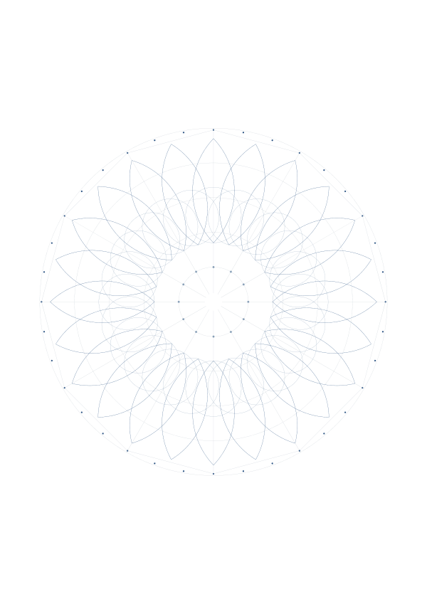 | **`mandala`** — a twelve-fold template: guide rings and spokes, a flower-of-life rosette, a double ring of lotus petals, two bead rings and a twelve-sided frame.<br>[`10-mandala.yaml`](10-mandala.yaml) · [PDF](10-mandala.pdf) |
| 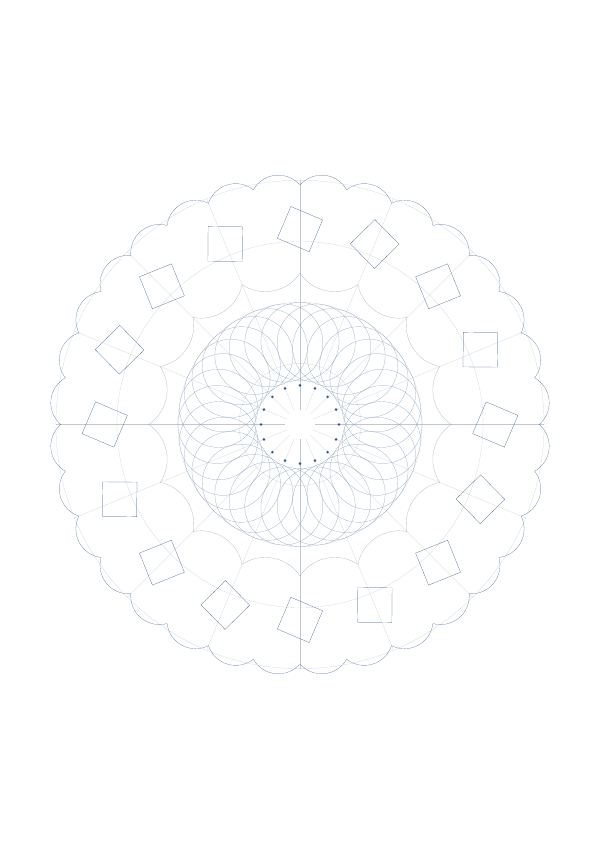 | **`mandala`** (variant) — the same blade, a different character: a scalloped outer border, a pinwheel of tilted squares, an inward-turned scalloped ring and a flower-of-life centre.<br>[`10b-mandala-scallops.yaml`](10b-mandala-scallops.yaml) · [PDF](10b-mandala-scallops.pdf) |
| 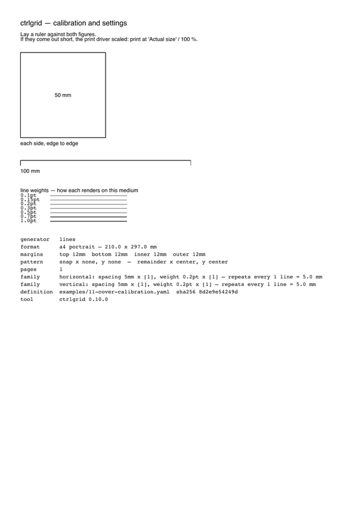 | **`--cover`** — the calibration cover sheet (§ 8.8): a 50 mm square and 100 mm rule to catch a scaling print driver, a ladder of stroke weights so you see how each one prints, and a settings summary. The preview is the cover; the grid it precedes is page two.<br>[`11-cover-calibration.yaml`](11-cover-calibration.yaml) · [PDF](11-cover-calibration.pdf) |
| 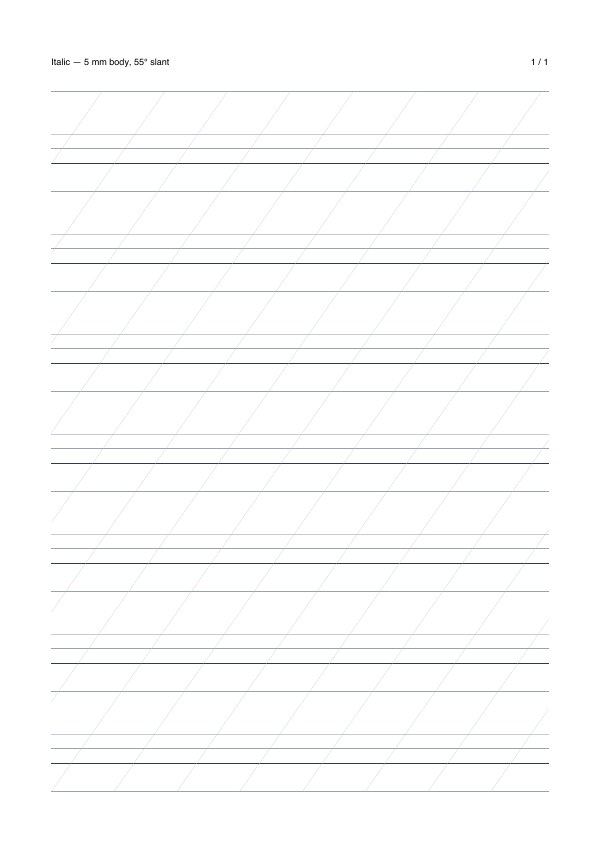 | **`lines`** (slanted) — an italic calligraphy guide: a ruled cycle of ascender, body, descender and air, crossed by a family at 55°. A slanted family is spaced *perpendicular* and clipped to the pattern area (§ 7.1).<br>[`14-calligraphy-italic.yaml`](14-calligraphy-italic.yaml) · [PDF](14-calligraphy-italic.pdf) |
|   | **`calendar` — a whole document** — a linked, write-on year planner: a cover, the year on one sheet, two half-year tables, twelve months, every day and three note pads, all cross-linked — tap a date and land on that day. The previews are a day page (schedule with half hours, tick boxes, squared notes) and January. 405 pages and ~1.6 MB, so this one ships without its PDF: `ctrlgrid -d examples/12-calendar-year.yaml -o calendar.pdf` builds it in about a second.<br>[`12-calendar-year.yaml`](12-calendar-year.yaml) · preset [`calendar-a4`](../ctrlgrid/data/presets/calendar-a4.yaml) |
| 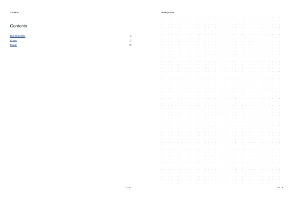 | **`notebook`** — several papers in one linked document: a cover, a contents page that links to each section, dividers, and sections filled by `dots`, `lines` and `staves`. The header names the section, the footer counts the pages. The previews are the contents and a journal page.<br>[`15-notebook.yaml`](15-notebook.yaml) · [PDF](15-notebook.pdf) · preset [`notebook-a4`](../ctrlgrid/data/presets/notebook-a4.yaml) |
| 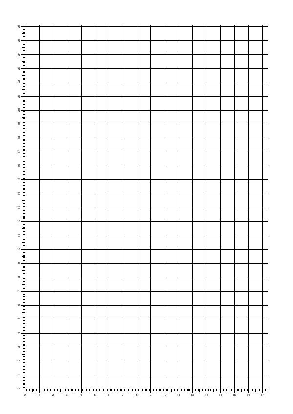 | **`ruler`** — the promise, on the sheet: a centimetre scale along the bottom and left edges, zeroed on the pattern area so the numbers agree with the grid. Print at 100 % and lay a real ruler against it.<br>[`13-ruler-edge.yaml`](13-ruler-edge.yaml) · [PDF](13-ruler-edge.pdf) |

The maze booklet uses a fixed seed for a reproducible set — regenerate it with:

```bash
ctrlgrid -d examples/05-maze-booklet.yaml --seed 4711 -o out.pdf
```
